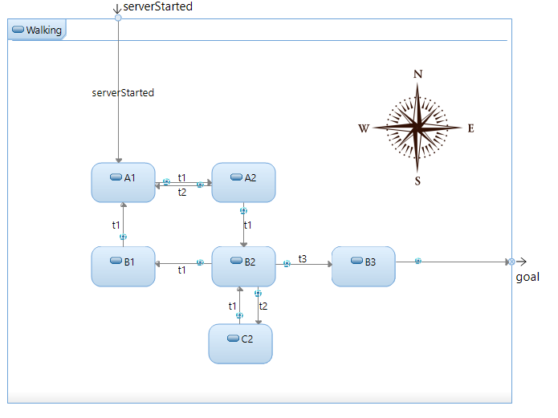

# gRPC Library and Sample
[gRPC](https://grpc.io/) is a Remote Procedure Call (RPC) framework for building systems of distributed applications in heterogeneous environments. This repository contains a [model library](/grpc-server-lib) that allows you to use gRPC in applications created with [DevOps Model RealTime](https://www.hcl-software.com/devops-model-realtime).

The repository also contains a sample [gRPC server](/grpc-server) (implemented with Model RealTime and using the model library) and [gRPC client](/grpc-client) (implemented as a C++ command-line application).

## Preparations
1. Download, build and install gRPC

Follow the steps in the [gRPC QuickStart guide](https://grpc.io/docs/languages/cpp/quickstart/) to install required build tools, clone the [gRPC GitHub repo](https://github.com/grpc/grpc), build gRPC from its source code and install the gRPC tools and libraries. Windows users can find more detailed instructions [here](https://github.com/grpc/grpc/blob/v1.61.0/BUILDING.md).

**NOTE 1:** The library and the sample are by default configured to be built with Visual Studio 17 (2022) using cmake for Win64 Debug. Transformation configurations for building with gcc 12 on Linux are also provided. If you want to use a different compiler, target platform or build configuration you must adjust arguments to cmake when building gRPC. You then also must update the TCs (or create new TCs) and use an appropriate cmake generator for building the client accordingly. The further steps assume you have the correct build tools in the path (for Visual Studio this is best accomplished by using a Visual Studio command prompt).

**NOTE 2:** Windows users that go with the default build configuration should also build the TargetRTS with the same settings. Follow [these steps](https://model-realtime.hcldoc.com/help/topic/com.ibm.xtools.rsarte.webdoc/Articles/Running%20and%20debugging/Debugging%20the%20RT%20services%20library.html?cp=23_2_13_1). In addition, set the `/MDd` flag in `LIBSETCCFLAGS` when editing `libset.mk` before building it (to use the debug version of C run-time library). The default build configuration for Linux uses the default TargetRTS and therefore builds without debug symbols.

2. Add the location where you installed the gRPC tools to your PATH environment variable

## Build the client
3. You need to build the client before the server since it contains the [.proto file](/grpc-client/proto/maze.proto) that describes the RPCs implemented by the server. This file is used both by the client and the server.

    a. Windows:
    ```
    ..grpc-client> mkdir build
    ..grpc-client> cd build
    ..grpc-client/build> cmake .. -G "Visual Studio 17 2022"
    ..grpc-client/build> cmake --build . --config Debug
    ```
    This will generate a Visual Studio solution file (`MazeWalker.sln`) which you can use for debugging the client application.

	  b. Linux:
    
    ```
    ..grpc-client> mkdir build
    ..grpc-client> cd build
    ..grpc-client/build> cmake .. -DCMAKE_INSTALL_PREFIX=GRPC Install location
    ..grpc-client/build> cmake --build . --config Debug
    ```

## Build the server
4. Open the [gRPC server](/grpc-server) project in Model RealTime. It uses the [gRPC model library](/grpc-server-lib) so import that project too into your workspace.
5. Open the TC file ([`server.tcjs`](/grpc-server/server.tcjs) or [`Linux_server.tcjs`](/grpc-server/Linux_server.tcjs)) and edit the variables in the beginning of the file that specify the location where you placed the gRPC source code (`grpcSourceLocation`) and where you installed the gRPC tools and libraries (`grpcInstallLocation`). See also comments in the TC for paths that you may have to update to match your environment.
6. If needed also edit the `targetServicesLibrary` property to specify the path to the TargetRTS to use. If you want to use the default TargetRTS that comes with Model RealTime, you can delete this property, but remember that with that version you cannot debug. Other properties that have to be modified depending on if you want to debug or not (and which compiler that is used) are `compileArguments` and `linkArguments`. By default they are set so you can debug with Visual Studio (the Linux TC by default does not build for debug).
7. Build the TC. It will first build the prerequisite [gRPC library](/grpc-server-lib) and then the server executable. Note that the TC for building the library is set-up to be built as a prerequisite of an executable TC. If you want to build the library TC by itself, you need to update it first (or create another TC).

## Run the sample
The sample application is about walking a maze represented with a state machine in the `Maze` capsule. From a state in the maze you can either go east, west, north or south. Valid paths are represented by transitions. If you find your way out of the maze (not very hard) you reach the goal.



The capsule has a `stepCount` variable which keeps track of the number of steps taken in the maze.

Launch the server executable that was generated when building the TC. If you launch with the Model Debugger you can visually inspect how the active state changes in the maze, and how the `stepCount` variable gets updated, as a result of client requests.

Finally launch the client executable `maze_client.exe` that was built previously. It has a simple command prompt where you can send commands to the server for walking the maze:

* **east, west, north, south** Take a step in the direction (if possible)
* **steps** Report the number of steps taken so far
* **adjust <arg>** Adjust the step counter with the specified argument (an integer)
* **subscribe** Subscribe to get notified about an attempt to take the wrong way in the maze
* **unsubscribe** Unsubscribe from the notifications about taking the wrong way in the maze
* **exit** Terminate the client

**NOTE:** The client and server by default communicate on port 50051 on localhost (i.e. you must run them on the same machine). You can change the port and hostname by means of the `--target` command-line argument for the client, and by means of the `-port` command-line argument for the server.

For example, to connect to the server running on a different machine and on a different port, first start the server on the remote machine like this:

```
maze_server.exe -port=50052
```

and then start the client like this:

```
maze_client.exe --target 172.27.223.1:50052
```

replacing 172.27.223.1 with the IP address of the machine where the server is running.

## How the sample works
Refer to the [.proto file](/grpc-client/proto/maze.proto) and the picture below to understand how the sample works:


### Asynchronous request without data
The "west", "east", "north" and "south" commands will cause an event to be asynchronously sent. They don't have a data parameter.

```protobuf
// Send an event without data
rpc GoWest (google.protobuf.Empty) returns (google.protobuf.Empty) {}
rpc GoEast (google.protobuf.Empty) returns (google.protobuf.Empty) {}
rpc GoNorth (google.protobuf.Empty) returns (google.protobuf.Empty) {}
rpc GoSouth (google.protobuf.Empty) returns (google.protobuf.Empty) {}
```

When the client sends these requests they will be intercepted by the server's thread (`ServerJob`) which will transfer them to the `gRPC_Server` capsule through its `external` port. Each request is represented by a subclass of the `CallData` class which implements a simple state machine describing the life cycle of an RPC request. The `gRPC_Server` capsule, which is run by the server's main thread, will then perform the sending of the corresponding event from the `Commands` protocol (`west()`, `east()`, `north()` and `south` respectively). This happens in  `CallData_Go::completeRequest()`. Note that since these events are asynchronously sent, the client can immediately proceed its execution and doesn't need to wait for a reply.

### Asynchronous request with data
The "adjust" command takes an integer as argument and the corresponding RPC therefore has an input message for transfering that data.

```protobuf
// Send an event with data
rpc AdjustStepCount (AdjustStepCountRequest) returns (google.protobuf.Empty) {}

// Adjustment of the step counter
message AdjustStepCountRequest {
  int32 adjustment = 1;
}
```

This request is handled by the server in exactly the same way as described above. The only difference is that the data that is passed is used as data for the parameter of the `adjustStepCount()` event. This happens in  `CallData_AdjustStepCount::completeRequest()`. 

### Synchronous request with reply data
The "steps" command causes the client to make a synchronous request to the server for getting the current step count. 

```protobuf
// Invoke an event with reply data
rpc StepCount (google.protobuf.Empty) returns (StepCountReply) {}

// Number of steps taken
message StepCountReply {
  int32 count = 1;
}
```

The server handles this request in the same way as the asynchronous requests, but the client will wait until the server finishes the request and provides the reply data (which is a simple integer). This happens in  `CallData_StepCount::completeRequest()`. 

### Subscribing for outgoing events
The client can subscribe to get notified by the server when an outgoing event is received by the `gRPC_Server` capsule on its `commands` port. 

```protobuf
// Subscribe for outgoing event with data
rpc Subscribe_WrongWay (google.protobuf.Empty) returns (stream WrongWay) {}
rpc Subscribe_GoalReached (google.protobuf.Empty) returns (stream StepCountReply) {} // Messages can be "reused"

  // Outgoing event 
message WrongWay {
  string message = 1;
}
  ```

  Subscription requests are managed by the server in a slightly different way than the requests covered so far. A subclass of `SubscribeData` is used for representing a subscription request. When it reaches the `gRPC_Server` capsule it's not immediately completed like other requests. Instead it is inserted into a map with an id string as key. The sample uses the name of the event ("GoalReached", "WrongWay") as the id string, but any id that uniquely identifies the event that is subscribed for can be used.

  Internal transitions in the `WaitForRequest` state of the `MyGRPC_Server` capsule get triggered when outgoing events arrive. They call `GRPC_Server::getSubscription()` for checking if there currently is an active subscription for the received event. If so, `SubscribeData::notifySubscriber()` is called on the subscription request object. This is where the server notifies the client about the received outgoing event by writing a reply for the subscription request.

  Note that the client needs to launch a separate thread which can wait for notifications from active subscriptions, without blocking the main thread. In the sample, the client uses one such thread for each outgoing event it subscribes to (at most two), but other alternatives, such as using a single thread for managing notifications from all active subscriptions, would also be possible.

### Unsubscribing for outgoing events
The server may offer a way for the client to unsubscribe from getting notified for outgoing events. In the sample, the server offers this for the `wrongWay()` event.

```protobuf
// Unsubscribe for outgoing event
rpc Unsubscribe_WrongWay (google.protobuf.Empty) returns (google.protobuf.Empty) {}
```

This is a regular request which is handled exactly like other non-subscription requests. From `CallData_Unsubscribe_WrongWay::completeRequest()` the subscription request is removed from the `gRPC_Server` capsule's map of active subscriptions by a call to `GRPC_Server::unsubscribe()`. Then the subscription request is finished, see `SubscribeData_WrongWay_unsubscribe()`.

In the sample client, the finishing of a subscription request will terminate the thread that was launched for managing that subscription while it was active.

## Start using the {{DOC_PRODUCT}} gRPC library
To start using the gRPC library for implementing a gRPC server in your own realtime application you can follow these steps:

1. Add the [`grpc-server-lib/grpc-lib.tcjs`](/grpc-server-lib/grpc-lib.tcjs) as a prerequisite of your TC. This library TC is set-up to reuse the properties defined in your executable TC, so you usually don't need to modify it. However, you need to add to your TC the inclusion paths and user libraries required by gRPC. You can copy this information from the ([`server.tcjs`](/grpc-server/server.tcjs)) of the sample server application.
2. Create a .proto file that defines what communication the server should implement. Define one or many services with unary RPCs for implementing asynchronous and synchronous sending of events from the client to the server, and use server streaming RPCs to let the client subscribe to be notified when the server sends out an event which the client is interested in. Use a unary RPC for unsubscribing, if you want to support that.
3. Create a capsule that inherits from the `GRPC_Server` capsule. For each service you defined add an attribute to this capsule that is typed by the `AsyncService` type that is generated by the proto compiler for that service.
4. Implement the pure virtual functions which your server capsule inherits from the `GRPC_Server` capsule:
	
 	a. registerServices() should call `RegisterService()` on the `ServerBuilder` it gets as argument, for each service attribute added.

	b. createCallDatas() should create instances of all `CallData` and `SubscribeData` subclasses that represent requests which the server should be able to handle (see below).

5. Create the CallData and SubscribeData subclasses for each RPC. Use CallData subclasses for unary RPCs and SubscribeData subclasses for server streaming RPCs. These subclasses need attributes according to what messages that are sent or replied with the RPC. See the sample application.
6. For both CallData and SubscribeData classes the constructor should call the trigger operation `proceed()`. This ensures that the state machine that represents the lifecycle of a request proceeds to the `Process` state, and calls the `startRequest()` function.
7. For both CallData and SubscribeData classes the `startRequest()` function should call a corresponding Request-function generated by the proto compiler for the RPC. Pass references to the attributes of the class in this call.
8. When a request arrives the server will again call the trigger operation `proceed()` which will advance the state machine to the `Finish` state. The triggered transition first calls `newCallData()` which should create another instance of the class (in the same way as in `createCallDatas()` above). After that it calls `completeRequest()` where the actual request is performed. This is where your server capsule will map the request to a corresponding `send()` or `invoke()` on a port. For synchronous requests you will also write a reply back to the client here using an `ServerAsyncResponseWriter` which is a utility class provided by the gRPC framework. A SubscribeData subclass should implement `completeRequest()` by calling `subscribe()` on the server capsule using an arbitrary but unique string as id.
9. SubscribeData subclasses, for which you want to support the client to unsubscribe, also need to implement an `unsubscribe()` function which should finish the subscription RPC.
10. The server capsule should redefine the `WaitForRequest` state and add internal transitions for those outgoing events the client can subscribe to be notified about. Their implementation first checks if there is an active subscription for the event by calling `getSubscription()`, using an arbitrary but unique string as id. If so, the client is notified by writing a reply on the active subscription RPC.

